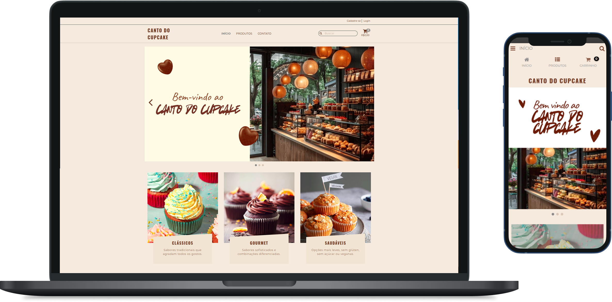

# PIT-II
# 🍰 Canto do cupcake – Projeto Acadêmico (No-Code)
## 📌 Sobre o Projeto
Este repositório contém o desenvolvimento de uma loja de cupcakes criada na plataforma no-code – NuvemShop, produzida como projeto acadêmico.  
A escolha por uma ferramenta no-code foi feita porque atualmente trabalho com design de interfaces (UI/UX), e meu objetivo principal era focar no design, estruturação das telas, usabilidade e experiência do usuário, simulando o fluxo de navegação de um e-commerce real.  
Embora o projeto reproduza a interface e o comportamento de uma loja profissional, não se trata de uma aplicação comercial e várias funcionalidades estão implementadas apenas para fins demonstrativos.   

## 🎯 Objetivo
Criar uma simulação funcional de um e-commerce de cupcakes, demonstrando:
- Estrutura de navegação;
- Layout responsivo;
- Interações básicas;
- Conceitos de UX aplicados;
- Fluxos de compra e checkout;
- Uso de boas práticas de interface.  

## ⚠️ Importante
Por ser um projeto educacional, alguns recursos não foram implementados totalmente, como:
- Processamento real de pagamento;
- Cálculo real de frete;
- Integração com serviços externos;
- Páginas em redes sociais;
- Pedido sendo realmente finalizado. 
As telas e interações simulam o comportamento de uma loja real, mas não efetuam vendas.   

## 🧁 Funcionalidades Criadas

Mesmo sendo um projeto acadêmico, diversas funções foram estruturadas para simular um e-commerce:
- Listagem de cupcakes;
- Filtro por categorias (“Clássicos”, “Gourmet”, “Saudáveis”);
- Detalhes do produto;
- Cálculo simulado de frete;
- Drawer lateral com resumo do pedido;
- Adicionar/Remover itens do carrinho;
- Fluxo de checkout (Entrega → Pagamento → Resumo);
- Página de contato;
- Newsletter.   

## 📄 Mais Informações
Este projeto foi criado exclusivamente para fins educacionais. 
Nenhuma venda é realizada. 
Nenhum dado pessoal é coletado. 
As interações são apenas simulações.
